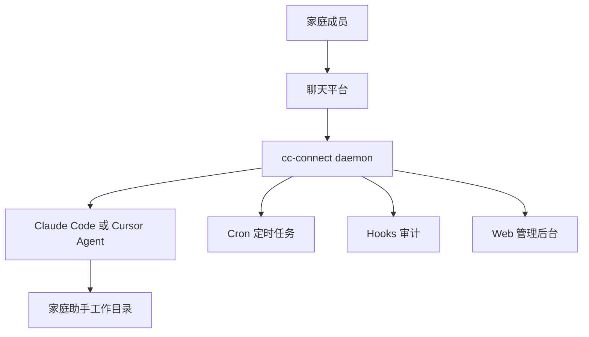

# cc-connect 家庭超级助手引导器

这是一个面向 GitHub 发布的 Go 引导程序，用于在全新 Mac、常开 Mac 或小主机上快速搭建：

- `cc-connect` 作为聊天平台入口（微信、飞书、Telegram 等）、会话网关、定时任务和事件调度器
- `Claude Code` 作为推荐运行时 Agent
- `Cursor Agent` 作为可选运行时 Agent 或开发维护助手
- 多个微信个人号同时接入同一个家庭助手 project

配置模板和工作区模板通过 Go `embed` 打进二进制。发布后只需要一个 `home-agent-bootstrap` 程序，即可生成 `config.toml`、`HOME.md`、`HEARTBEAT.md`、`CLAUDE.md` 并执行后续引导。

## 快速开始

开发模式：

```bash
git clone <your-repo-url>
cd home-agent-bootstrap
go run . bootstrap
```

构建本地二进制：

```bash
go build -o home-agent-bootstrap .
./home-agent-bootstrap bootstrap
```

如果你已经装好依赖，只想生成配置：

```bash
INSTALL_DEPS=0 go run . bootstrap
```

安装器会交互式完成：

1. 检查并引导安装 Xcode Command Line Tools、Homebrew、Node.js/npm、ffmpeg。
2. 安装 `cc-connect`。
3. 引导选择并安装 `Claude Code` 或 `Cursor Agent`。
4. 配置 LLM（Claude Code 登录或 Anthropic/OpenAI/OpenRouter/Kimi/火山/通义等预设 Provider）。
5. 从 cc-connect 支持列表选择接入平台（可多选，含微信个人号）。
6. 生成 `~/.cc-connect/config.toml`。
7. 创建家庭助手工作目录，默认 `~/home-assistant-workspace`。
8. 写入 `HOME.md`、`HEARTBEAT.md`、`CLAUDE.md`。
9. 若包含微信，默认逐个扫码绑定并自动回填管理员角色。
10. 输出 daemon 启动命令和管理后台地址。

微信扫码绑定后，需要先在每个已绑定微信号里给机器人发送 `/login`，再发送普通消息或 `/whoami`。

## 推荐架构



## 常用命令

绑定多个微信个人号：

```bash
go run . setup-weixin 2
```

启动 daemon：

```bash
go run . start
```

检查环境：

```bash
go run . doctor
```

查看日志：

```bash
cc-connect daemon logs -f
```

## 文件结构

```text
main.go
main_test.go
go.mod
templates/
  config.generated.toml.tmpl
workspace/
  HOME.md
  HEARTBEAT.md
  CLAUDE.md
docs/
  fresh-mac.md
  configuration.md
  platforms.md
  multi-weixin.md
  security.md
  plans/
```

## 不要提交的内容

不要把以下内容提交到 GitHub：

- `~/.cc-connect/config.toml`
- `~/.cc-connect/weixin/`
- 微信 ilink token
- Management、Bridge、Webhook token
- Claude/Cursor 登录凭据

## 参考文档

- [全新 Mac 引导](docs/fresh-mac.md)
- [配置说明](docs/configuration.md)
- [接入平台选择](docs/platforms.md)
- [多微信个人号](docs/multi-weixin.md)
- [安全建议](docs/security.md)
