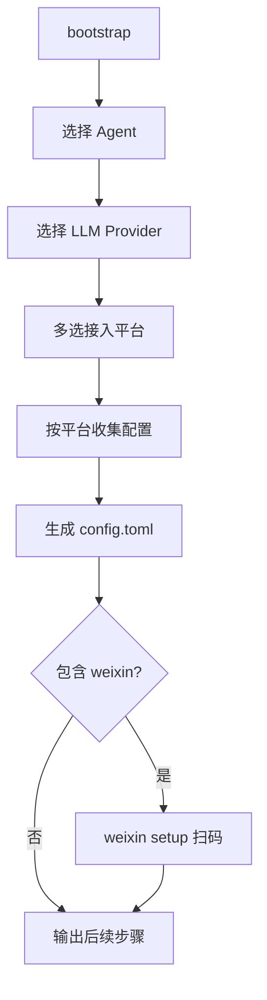

# 平台与 LLM 选择接入设计

## 背景

`home-agent-bootstrap` 是 cc-connect 的引导器，负责生成本机 `~/.cc-connect/config.toml` 和家庭工作区。此前交互与模板仅支持微信个人号（`weixin`），LLM 仅提供 Anthropic、OpenAI 和手动自定义 OpenAI-compatible。

用户期望：

1. 接入平台应从 cc-connect 官方支持列表中选择，而非写死微信。
2. LLM 配置应类似 OpenClaw：选择厂商预设后输入 API Key 即可。

## 平台支持列表来源

平台清单对齐 [cc-connect 上游 README](https://github.com/chenhg5/cc-connect) 与 `docs/usage.md` 中 `[[projects.platforms]].type` 取值：

| type | 显示名 | 连接方式 | 公网 IP |
|------|--------|----------|---------|
| feishu | 飞书 / Lark | WebSocket | 否 |
| dingtalk | 钉钉 | Stream | 否 |
| telegram | Telegram | Long Polling | 否 |
| slack | Slack | Socket Mode | 否 |
| discord | Discord | Gateway | 否 |
| wecom | 企业微信 | WebSocket / Webhook | 视模式 |
| weixin | 微信个人号 | ilink 长轮询 | 否 |
| line | LINE | Webhook | 是 |
| qq | QQ (NapCat/OneBot) | WebSocket | 否 |
| qqbot | QQ 官方机器人 | WebSocket | 否 |
| weibo | 微博 | WebSocket | 否 |

引导器维护 `PlatformPreset` 注册表，包含必填字段默认值与 cc-connect 文档路径。非微信平台在 bootstrap 阶段只生成配置骨架并提示后续在开放平台补全凭证；仅 `weixin` 支持 bootstrap 内扫码绑定（`cc-connect weixin setup`）。

## LLM Provider 预设

Claude Code 分两类配置：

| 方式 | 适用 | 写入位置 |
|------|------|----------|
| 官方 | Claude Code 登录、Anthropic API Key | 登录流程 / `config.toml` `[[projects.agent.providers]]` |
| 第三方 | OpenAI、OpenRouter、Kimi、火山、通义、自定义 | `config.toml` `[[projects.agent.providers]]`，并同步 shell 配置文件中的 `ANTHROPIC_*` 环境变量块 |

第三方预设默认模型与 base_url（Kimi 见 [官方文档](https://platform.kimi.com/docs/guide/agent-support)）：

| name | 默认 ANTHROPIC_BASE_URL | 默认 model |
|------|-------------------------|------------|
| openai | https://api.openai.com/v1 | gpt-4.1 |
| openrouter | https://openrouter.ai/api/v1 | anthropic/claude-sonnet-4 |
| kimi | https://api.moonshot.cn/anthropic | kimi-k2.5 |
| volcengine | https://ark.cn-beijing.volces.com/api/v3 | 用户指定 |
| qwen | https://dashscope.aliyuncs.com/compatible-mode/v1 | qwen-plus |

`cursor` Agent 仍跳过 Provider 写入，依赖 Cursor 账号登录。Claude Code 第三方 Provider 必须写入 `config.toml` 的 `[[projects.agent.providers]]`，否则 `cc-connect daemon` 启动 Claude Code 子进程时拿不到自定义 LLM 环境变量，容易出现 `Not logged in. Please run /login.`。

## 配置模型

```go
type PlatformBlock struct {
    Type    string
    Options []PlatformOption // 有序键值，用于 TOML 渲染
}

type RenderConfigInput struct {
    // ...
    Platforms []PlatformBlock
}
```

模板对 `Platforms` 循环渲染 `[[projects.platforms]]`，不再写死 `type = "weixin"`。

## 交互流程



## 安全边界

- API Key、平台 Secret 只写入本机 `config.toml`，不进仓库模板。
- 生成的配置不提交 Git。
- 非微信平台不自动调用第三方登录，避免引导器承担过多 OAuth 流程。

## 与 cc-connect 的关系

本仓库不实现聊天平台运行时逻辑；平台能力以已安装的 `cc-connect` npm 包为准。引导器注册表需随上游新增平台时同步更新。
