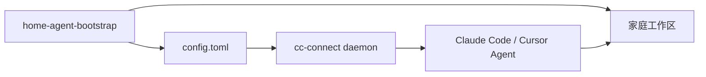

# home-agent-bootstrap Roadmap

> 目标：把本项目做成 cc-connect 家庭版一键部署包 + 默认 Agent 工作区。运行时能力继续交给 cc-connect 和 Claude Code / Cursor Agent。

## 产品边界

- 本项目负责：安装引导、默认配置、工作区模板、排障与升级提示
- 本项目不负责：聊天平台协议、daemon 运行时、cron/web admin 本体实现

## 优先级说明

| 标记 | 含义 |
|------|------|
| P0 | 必做，直接影响首次部署成功率 |
| P1 | 高价值，形成差异化 |
| P2 | 可选，按实际需求推进 |
| P3 | 暂不做，避免偏离边界 |

---

## Phase 1 安装器可靠（P0）

目标：bootstrap 一次跑通，daemon 下 Claude Code 能正确读取 Provider。

- [x] P0 强化 `doctor`：检查 config 结构、`[[projects.agent.providers]]`、`provider` 引用、cc-connect 版本、daemon 状态
- [x] P0 增加配置迁移提示：检测旧版顶层 `[[providers]]` / `provider_refs`，给出升级说明或自动迁移脚本
- [x] P0 补模板 golden test：确保 `templates/config.generated.toml.tmpl` 输出稳定
- [x] P0 补平台一致性测试：`platforms.go` 与 `docs/platforms.md` 序号和 type 对齐
- [x] P0 发布第一个稳定 Release：验证 CI、tag 构建、README 安装说明
- [ ] P1 非交互 bootstrap 预设：支持 env/flags 跳过部分问答，便于重装和小主机自动化
- [ ] P1 安装失败时明确报错：Homebrew、npm、cc-connect、daemon install 不再静默忽略关键错误

## Phase 2 工作区 starter kit（P1）

目标：从“安装脚本”升级为“家庭助手默认工作区发行版”。

- [ ] P1 workspace 模板版本号：bootstrap 可提示“有新模板”，支持只补缺失文件
- [ ] P1 Heartbeat 启用向导：首次对话后提示填写 `session_key` 并取消注释
- [ ] P1 丰富 `members.md` / `devices.md` / `tasks.md` 示例，降低首次填写门槛
- [ ] P1 补家庭场景技能包：提醒、待办、账单周期、设备控制前确认
- [ ] P2 增加 `skills/` 模板校验：确保 frontmatter 和目录名一致
- [ ] P2 提供“示例家庭助手”演示 workspace，供新用户参考

## Phase 3 家庭治理与安全（P1 / P2）

目标：让家庭场景默认更安全、更可审计。

- [ ] P1 bootstrap 增加权限模板：仅自己可用 / 家人只读 / 家人可提醒不可执行
- [ ] P1 文档和 skill 补 token 泄露恢复流程：停 daemon、轮换 token、重装绑定、查 audit log
- [ ] P2 提供 management/bridge/webhook token 轮换 helper
- [ ] P2 `doctor` 增加端口暴露检查：9820 / 9810 / 9111 是否仅本机可访问
- [ ] P2 审计日志巡检 skill：定期查看 `~/.cc-connect/audit/events.log`

## Phase 4 外部集成（P2）

目标：接入家庭自动化，但只做集成规范和模板，不做设备协议本身。

- [ ] P2 生成 webhook 调用示例，对接 Home Assistant 或本地 `home-tools`
- [ ] P2 workspace skill 封装受控 HTTP / MCP 调用规范
- [ ] P2 文档补 Bridge 使用场景和最小示例
- [ ] P3 不要在 bootstrap 内实现具体 Home Assistant 插件或设备驱动

## 持续同步层（贯穿所有阶段）

目标：避免 docs、模板、cc-connect 上游再次漂移。

- [ ] P0 跟踪 cc-connect release changelog，更新 `platformPresets` / Provider 预设
- [x] P0 文档示例与模板字段保持一致，改动模板时同步改 docs 和 tests
- [ ] P1 增加 cc-connect 版本下限提示：bootstrap 或 doctor 检测过旧版本
- [ ] P2 评估是否需要定期自动抓取上游平台列表做对照检查

---

## 前 10 个建议任务

按推荐执行顺序排列：

1. P0 强化 `doctor`
2. P0 旧配置迁移提示（`[[providers]]` → `[[projects.agent.providers]]`）
3. P0 模板 golden test
4. P0 平台列表一致性测试
5. P0 发布第一个稳定 Release
6. P1 Heartbeat 启用向导
7. P1 workspace 模板版本提示
8. P1 家庭场景技能包
9. P1 bootstrap 权限模板
10. P1 非交互 bootstrap 预设

---

## 暂不做

- P3 重写或替代 cc-connect
- P3 做成通用 Agent 框架
- P3 大量业务逻辑写进 Go，而不是生成配置和工作区
- P3 继续扩展手写 TOML 字符串编辑，而不引入结构化解析
- P3 自研 Web UI（cc-connect 已有管理后台）
- P3 SaaS / 多租户托管
- P3 默认自动执行高风险家庭动作

---

## 完成标准

每个阶段可以按下面标准验收：

### Phase 1

- 新用户从 Release 二进制到 daemon 正常运行，不需要手工改 Provider 结构
- `go test ./...` 覆盖模板和平台一致性
- `doctor` 能识别常见配置错误

### Phase 2

- 新 workspace 自带可理解的家庭模板和至少 1 套示例技能
- 用户知道如何启用 Heartbeat

### Phase 3

- 默认权限策略清晰，文档和 bootstrap 选项一致
- 有完整的安全事故恢复说明

### Phase 4

- 至少 1 个 webhook / 本地工具集成示例可跑通

---

## 关联文档

- [平台与 LLM 选择设计](docs/plans/2026-05-24-platform-llm-selection-design.md)
- [Project Hardening 设计](docs/plans/2026-05-31-project-hardening-design.md)
- [配置说明](docs/configuration.md)
- [安全建议](docs/security.md)
